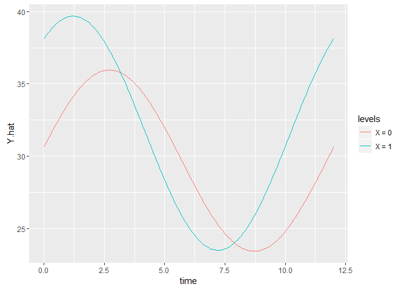

Installation
------------

This is an R package for estimation and prediction of the cosinor model for periodic data. It allows for covariate effects and provides tools for inference on the mean shift, amplitude, and acrophase. Check out the shiny app that illustrates the model here:

<http://sachsmc.shinyapps.io/cosinor-shinyapp/>

The package is on CRAN and can be installed as follows

``` r
install.packages("cosinor")
```

To install from github, you must first have the `devtools` package installed. Then run this command to install the latest version:

``` r
devtools::install_github("cosinor", "sachsmc")
```

Model details
-------------

For outcome $Y$, time variable $t$, and fixed period $D$ it is of interest to fit the periodic model

$$
Y(t) = \alpha + \beta_1 * \cos\{2 * \pi * t / D - \beta_2\} + \varepsilon
$$

where $\alpha$ is the intercept, $\beta_1$ is the amplitude, and $\beta_2$ is the acrophase (also called phase-shift). The $\varepsilon$ is an error term with mean 0.

This model transforms so that it can be fit using a simple linear model. Let $r = \cos\{2 * \pi * t / D\}$ and let $s = \sin\{2 * \pi * t / D\}$. Then we have

$$
Y(t) = \alpha + \gamma_1 * r + \gamma_2 * s + \varepsilon.
$$

The original coefficients can be recovered as follows:

$$
\beta_1 = \sqrt{\gamma_1^2 + \gamma_2^2}
$$

and

$$
\beta_2 = tan^{-1}(\gamma_2 / \gamma_1).
$$

In the package, $(\alpha, \gamma_1, \gamma_2)$ is estimated using `lm`, and inference on the transformed coefficients is obtained using the delta method.

Example usage
-------------

Load the package into your library:

``` r
library(cosinor)
```

The package comes with an example dataset called `vitamind` to illustrate the usage. Fit a basic cosinor model with covariates:

``` r
fit <- cosinor.lm(Y ~ time(time) + X + amp.acro(X), data = vitamind, period = 12)
```

The time variable is indicated by the `time` function in the formula. By default, the period length is 12. Covariates can be included directly in the formula to allow for mean shifts. To allow for differences in amplitude and acrophase by covariate values, include the covariate wrapped in the `amp.acro` function in the formula. Let's summarize the model.

``` r
summary(fit)
```

    ## Raw model coefficients:
    ##             estimate standard.error lower.CI upper.CI p.value
    ## (Intercept)  29.6898         0.4654  28.7776  30.6020  0.0000
    ## X             1.9019         0.8041   0.3258   3.4779  0.0180
    ## rrr           0.9308         0.6357  -0.3151   2.1767  0.1431
    ## sss           6.2010         0.6805   4.8673   7.5347  0.0000
    ## X:rrr         5.5795         1.1386   3.3479   7.8111  0.0000
    ## X:sss        -1.3825         1.1364  -3.6097   0.8447  0.2237
    ## 
    ## ***********************
    ## 
    ## Transformed coefficients:
    ##             estimate standard.error lower.CI upper.CI p.value
    ## (Intercept)  29.6898         0.4654  28.7776  30.6020   0.000
    ## [X = 1]       1.9019         0.8041   0.3258   3.4779   0.018
    ## amp           6.2705         0.6799   4.9378   7.6031   0.000
    ## [X = 1]:amp   8.0995         0.9095   6.3170   9.8820   0.000
    ## acr           1.4218         0.1015   1.2229   1.6207   0.000
    ## [X = 1]:acr   0.6372         0.1167   0.4084   0.8659   0.000

This prints the raw coefficients, and the transformed coefficients. The transformed coefficients display the amplitude and acrophase for the covariate = 1 group and the covariate = 0 group. Beware when using continuous covariates!

Testing is easy to do, tell the function which covariate to test, and whether to test the amplitude or acrophase. The global test is useful when you have multiple covariates in the model.

``` r
test_cosinor(fit, "X", param = "amp")
```

    ## Global test: 
    ## Statistic: 
    ## [1] 2.59
    ## 
    ## 
    ##  P-value: 
    ## [1] 0.1072
    ## 
    ##  Individual tests: 
    ## Statistic: 
    ## [1] 1.61
    ## 
    ## 
    ##  P-value: 
    ## [1] 0.1072
    ## 
    ##  Estimate and confidence interval[1] "1.83 (-0.4 to 4.05)"

The predict function allows you to estimate the mean value of your outcome for individuals. This is useful for adjusting for the seasonal effects on some measurement. Let's compare the raw values to the seasonally adjusted values of the vitamin D dataset.

``` r
summary(vitamind$Y)
```

    ##    Min. 1st Qu.  Median    Mean 3rd Qu.    Max. 
    ##   13.27   25.59   29.79   30.09   34.85   51.30

``` r
summary(predict(fit))
```

    ##    Min. 1st Qu.  Median    Mean 3rd Qu.    Max. 
    ##   16.10   25.98   29.26   29.69   33.59   46.48

Plotting the fitted curves is also easy to do. Currently only `ggplot2` is supported.

``` r
library(ggplot2)
ggplot.cosinor.lm(fit, x_str = "X")
```


